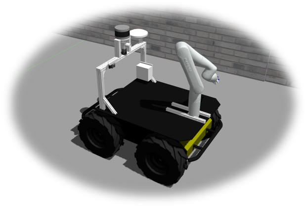
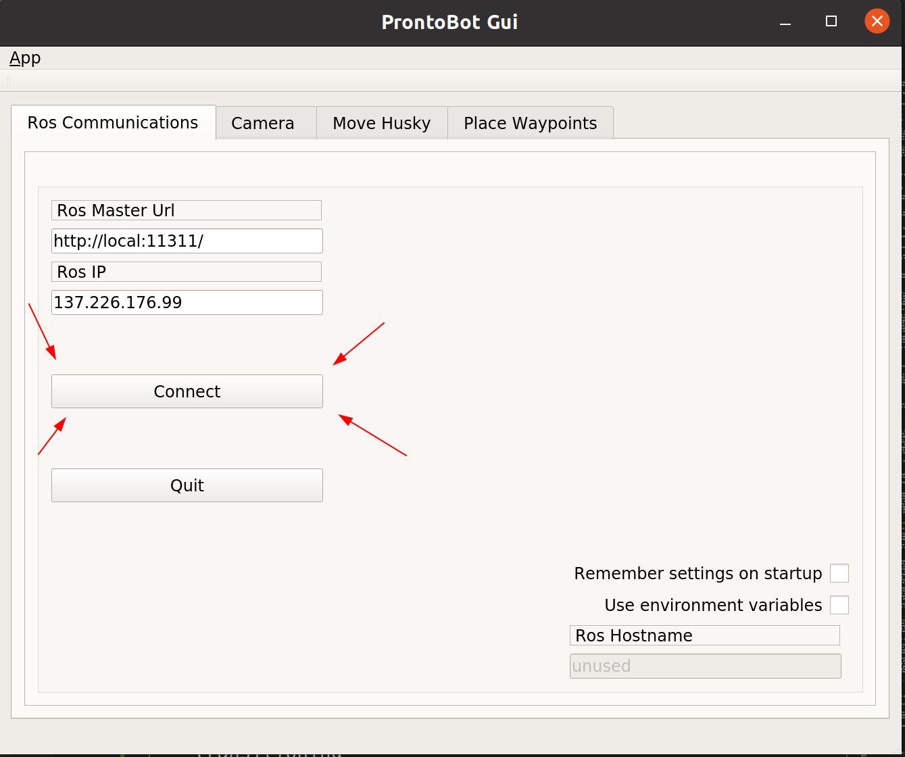
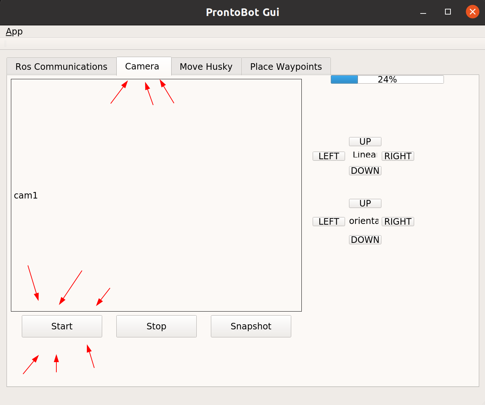
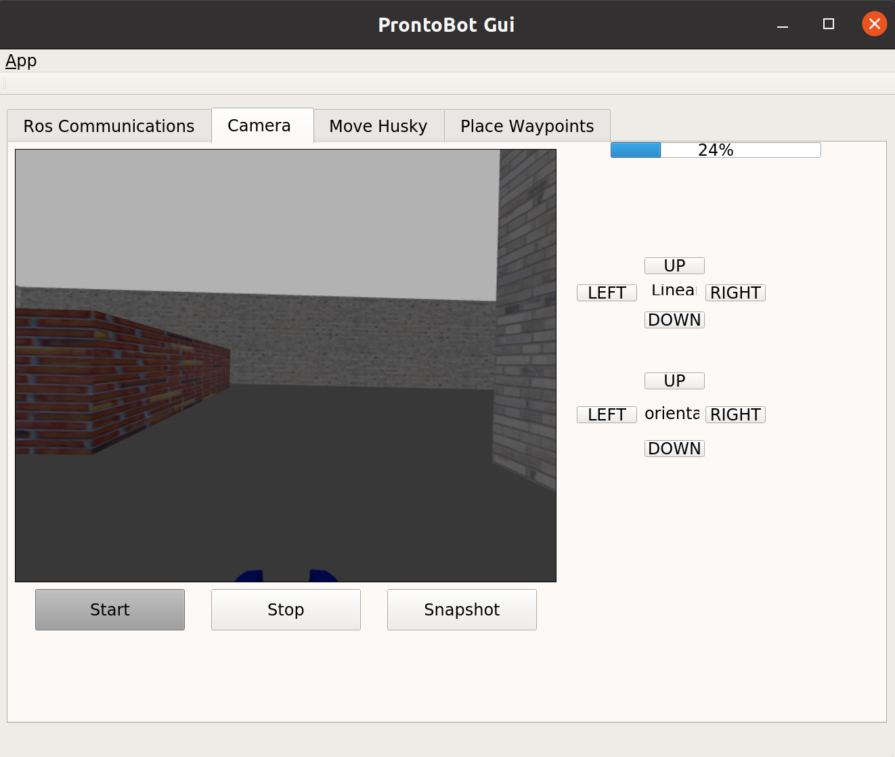
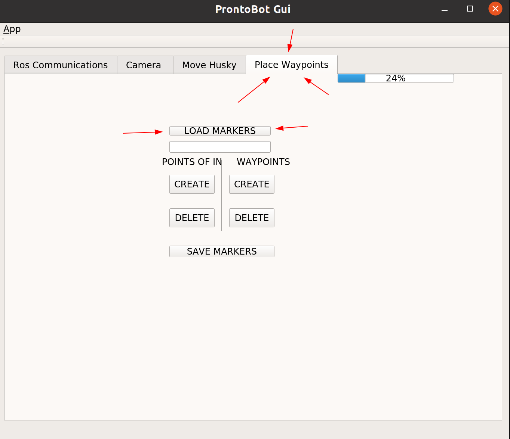

# Group 15 – SAM|XL project – ProntoBot


*By: Edoardo Panichi, Yohan Le Gars, Mathijs van Geerenstein and Paul Féry*


<details open="open">
<summary>Table of Contents</summary>

- [About](#section_about)
- [Installation](#section_install)
	- [1. Steps for the normal simulation](#1-steps-for-the-normal-simulation)
	- [2. Steps for the our extra packages](#2-steps-for-the-our-extra-packages)
- [Our Packages](#section_packages)
	- [State Machine](#state_machine)
	- [User Graphical Interface](#gui)
	- [Arm Control](#arm_ctrl)
	- [Interactive Markers](#markers)
	- [Human Detection: LIDAR](#lidar_detect)
	- [Human Detection: Camera](#cam_detect)
- [How to use the code](#how-to-use-the-code)
- [Extras](#section_extras)
	- [Camera on the Manipulator](#camera)
	- [Frontier Exploration](#frontier)
    - [Video Demonstration](#video-demonstration )
</details>


## <a name="section_about"></a>About

This repository provides the source code and documentation for the Robotics Multidisciplinary Project in collaboration with SAM|XL. The aim of the project is to provide a solution to the following problem: 

**"The operators of the gantry robot at SAM|XL are currently not capable of monitoring its activity in a reliable
and safe manner, without putting themselves at risk by standing in the robot’s workspace."**

The approach to the problem is focused around using a [Husky robot by Clearpath](https://clearpathrobotics.com/husky-unmanned-ground-vehicle-robot/), equipped with a [Kinova gen3 Lite robot arm](https://www.kinovarobotics.com/product/gen3-lite-robots). Our goal is to provide functionalities for using the robot as an on site monitoring assistant. For this, The robot will be carrying a camera at the end effector, which can be used to remotely surveil any process. Our aim is to provide software that is ***safe***, ***easy to use*** and ***adaptable*** to a wide range of situations and environments.




### Video Demonstration
If you want to quickly understand which are the features of our solution, we prepered a quick video where the main functionality are shown and briefly explained. Have a look on: https://youtu.be/A3Ag6SxMBqE


## <a name="section_install"></a>Installation


Welcome to the Multidisciplinary Project - Husky Simulation repository! This repository aims to be a simple one stop shop for simulating Husky.

**Important:** The only officially supported Ubuntu/ROS version is Bionic/Melodic for the Husky simulation.

### 1. Steps for the normal simulation
Create a catkin workspace and clone all required dependencies listed in `cor_mdp_husky.rosinstall`. To automate the process [vcstool](http://wiki.ros.org/vcstool) can be used:

``` bash
mkdir -p <my_catkin_ws>/src # if no catkin_ws yet
cd <my_catkin_ws>/src
git clone https://gitlab.tudelft.nl/cor/ro47007/2022/team-15/cor_mdp_husky.git
vcs import --input cor_mdp_husky/cor_mdp_husky.rosinstall .
cd ..
```

> Note: ros_kortex require additional step to build, follow the steps on [ros_kortex](https://github.com/Kinovarobotics/ros_kortex.git)

Install any system dependencies before build
``` bash
sudo rosdep init
rosdep update
rosdep install --from-paths src --ignore-src --rosdistro=$ROS_DISTRO -y
```

Finally build and source the workspace:
``` bash
catkin build && source devel/setup.bash
```

### 2. Steps for the our extra packages
Under this section we will list all the extra packages needed to run the execute the new features we implemented.
> Notice: an explanation of the features is located in the next section or in the dedicated folders. 


- [`Camera detector`](camera_detector): This package has two dependencies that must be presently installed for the code to run properly. Those are the ROS packages ```vision_msgs``` and ```vision_opencv```. If you do not have these packages installed, you can do so by using the following commands:
    - ```vision_msgs```:
        ``` bash
        sudo apt install ros-melodic-vision-msgs
        ```
    - ```vision_opencv```:
        ``` bash
        sudo apt install ros-melodic-vision-opencv
        ```
- [`Check for humans`](check_for_humans): The main package needed to run this code is the algorithm for clustering (DBSCAN). To install it you need to have `pip`. If you do NOT have it, then follow the next three steps:
    - Step 1:
        ``` bash
        sudo apt-get update
        ```
    - Step 2:
        ``` bash
        sudo apt-get install python-pip python-dev build-essential
        ```
    - Step 3:
        ``` bash
        sudo python -m easy_install pip
        ```

    Now that you have `pip` you can install the actual library for the clustering algorithm:
    ``` bash
    pip install -U scikit-learn
    ```

    One more package you might need if not already installed `rospkg`. To install it run:
    ``` bash
    sudo apt-get install python-rospkg
    ```

    There is one last package you need to remove a warning from the code execution:
    ``` bash
    sudo apt install libcanberra-gtk-module libcanberra-gtk3-module
    ```

- [`Kinova planning`](cor_mdp_husky_kinova_planning): This package does not rely on any python package outside of ```numpy```. If you don't have it yet, you can install it using:

	``` bash
	  pip install numpy
	```
	
	Additionally, this packages makes use of a custom service message defined in [```check_for_humans```](check_for_humans)

- [`Point manager`](point_mgmt): This package does not rely on any external code, except for the companion package [```point_mgmt_msgs```](point_mgmt_msgs). That package is already present within this repository, which means that no additional installation steps need to be taken here.
- [`Qtros`](qtros): To run this package, you first need to install qt5 software.
	```bash
	  sudo apt-get update
	  sudo apt-get install qt5-default
	  sudo apt-get install qtcreator
	  sudo apt-get install ros-melodic-qt-create
	  sudo apt-get install ros-melodic-qt-build
	```    
- [`State machine`](state_machine): To use correctly the state machine, you need to install some extra packages in ROS:
	``` bash
	sudo apt-get update
	```
	``` bash
	sudo apt-get install ros-melodic-smach ros-melodic-smach-ros ros-melodic-executive-smach ros-melodic-smach-viewer
	```


## <a name="section_packages"></a>Our Packages
This section covers every package that we have implemented ourselves. Each package is described briefly. Clicking on the section names will send you to the package locations themselves, where you can read about them in more detail.

### <a name="state_machine"></a>**[State Machine](state_machine)**
The state machine is implemented in the file called *state_machine.py*. It uses the ROS library [smach](https://wiki.ros.org/smach). It works as the logic controller of the robot, defining a strict sequence of states that are activated. States can be directly linked to ROS nodes (like `check_for_humans`) or they can represent other things (like the state that verifies that the connection with the UR5 is working correctly).
Note that it is not a ROS node, but given the characteristics of *smach*, it is possible quickly create states that subscribe to topics or publish on them.

The state machine can be easily run as a simple python file, after that the main simulation has been launched. To do so, open a terminal window in the folder that contains `state_machine.py`, and run the followings:
``` bash
source devel/setup.bash
```
``` bash
cd <directory_of_your_code>
python state_machine.py
```

### <a name="gui"></a>**[User Graphical Interface](qtros)**
This package contains a node that builds the graphical user interface window. Inside `src`, three cpp files are present to declare the various subsribed topics, the callback functions and the qt widgets implementations. Inside `include` are the respective hpp files. Inside `ui`, a ui file can be found where the several widgets (buttons, screen displays, window size, tabs) were designed. The ui file has been built with Qt5 software. Inside `resources` are logo pictures.


You then can run the node with the following:
``` bash
rosrun qtros qtros
```
The current gui allows the user to connect to the master node within ros communication tab. More detailed explanations can be found in the [readme](qtros/README.md) of qtros package.


### <a name="arm_ctrl"></a>**[Arm control](cor_mdp_husky_kinova_planning)**
This node controls the Kinova manipulator with a camera at its end effector. The node provides 3 top level functions:
- Move arm to a resting pose.
- Move arm to a standing pose and point the camera to a desired 3D point. 
- Move arm to continuously track a desired 3D point in space with the camera.

To run the node by itself:

``` bash
cd <my_catkin_ws> # run from your catkin workspace directory
source devel/setup.bash
rosrun cor_mdp_husky_kinova_planning kinova_planning_node
```

A more detailed description can be found in the packages' [readme](cor_mdp_husky_kinova_planning/README.md). 

### <a name="markers"></a>**[Interactive Markers](point_mgmt)**
So called “waypoints” and “points-of-interest” lie at the center of the method we are using in order to control our robot. Those can be managed through a server node, defined within the ```point_mgmt``` package.
For a demonstration of ways in which you can use it, run this command from your catkin workspace root directory:
```
source devel/setup.bash
roslaunch point_mgmt point_mgmt_with_simulation.launch
```
You should see the gazebo and Rviz windows popping up on your screen, as well as another terminal, which will provide you with information about the current activity of the ```point_mgmt``` server node. Additionally, the RViz window should contain a set of markers, in addition to the rendering of the robot and its sensor measurements. If you do not see those markers, make sure the ```Fixed Frame``` option under ```Global Options``` in RViz is set to “map”. Additionally, make sure that interactive markers are present in the displays of RViz.
The server node allows you to move waypoints on the ground plane and points of interest in 3-dimensional space directly within RViz.

Have a look at the documentation present within the package itself for more detailed instructions and discussions of the node's features and services.

### <a name="lidar_detect"></a>**[Human Detection: LIDAR](check_for_humans)**
Once the LiDAR detects a possible pedestrian, through the node implemented in this package we call a service that interacts with the `camera_detector` package. In this way we can double check on the LiDAR proposal with the camera.

The usage of the LiDAR for proposing possible locations where a human might be is particularly efficient since the clustering algorithm is pretty fast and the accuracy is quite high. Moreover, the LiDAR always performs 360-degree scans, which allows us to detect possible people all around the robot without moving continuously the camera or the base of the robot.

To run only the node `check_for_humans`, you can execute the following commands:
``` bash
source devel/setup.bash
```
``` bash
rosrun check_for_humans lidar_proposals.py
```

### <a name="cam_detect"></a>**[Human Detection: Camera](camera_detector)**
The camera detector package instantiates a node, which runs a simple SVM which performs detections of Humans in an image, using HOG features. It can be interfaced with at any time, using a service called "```look_for_humans```", which upon being called, will provide its client with information about its current detections.

The human detection done by the camera provides additional robustness to the "checking for humans" process: proposed locations where humans could be standing are provided by the lidar. Those are then confirmed or denied by the camera.

To run the node on its own, run the following commands:
```
source devel/setup.bash
rosrun camera_detector camera_detector_node
```

## How to use the code 
Here you will find the *standard* way to use our solution. If you want to personalize more the experience you have to read the readmes in the different folders to understand what else you can do.

> Only for the first time you run the code. Open the file [samxl_testmap.yaml](cor_mdp_husky_gazebo/maps/samxl_testmap.yaml) (the file on your pc and not the one in the repository!!) and modify the path according to your pc.
You will probably have something like: 

> /\<path-to-home\>/\<catkin-workspace\>/src/cor_mdp_husky_gazebo/maps/samxl_testmap..pgm

- First of all, open two terminal windows.
- In the first one execute:

    Enter in your workspace with:
    ``` bash
    cd <your_catkin_workspace>
    ```
    ``` bash
    source /opt/ros/melodic/setup.bash
    ```
    Build and source the workspace with:
    ``` bash
    catkin build && source devel/setup.bash
    ```
    Launch the simulation with:
    ``` bash
    roslaunch cor_mdp_husky_gazebo husky_samxl_prontobot.launch localization:=amcl
    ```
    As result, the GUI by ProntoBot will appear. Moreover, multiple terminals pop out on the monitor.  Each window takes care of showing the output of a node. For example you will see a terminal that shows the output for the packages `camera_detector`, `check_for_humans`, `cor_mdp_husky_kinova_planning`, `point_mgmt` and `qtros`. Some of these are useful in the next steps.
    


- In the second one execute:
    ``` bash
    cd <your_catkin_workspace>
    ```
    ``` bash
    source devel/setup.bash
    ```
    Run the state machine from the workspace folder with: 
    ``` bash
    python src/cor_mdp_husky/state_machine/state_machine.py
    ```
- Now before pressing any other button look at the second terminal for the following line:

    ```
    [INFO] [1655656165.429889, 2947.873000]: State machine transitioning 'STARTING_GUI':'GUI_active'-->'GUI_GREEN_LIGHT'
    ```
    > If your state machine is stuck in the state `CHECK_MAIN_ROBOT` means that the simulation has a bug and you should restart the process.

    This means that the state machine is waiting to communicate with the GUI. To allow this communication, open the GUI by ProntoBot and click the button `Connect`.
    

- Now looking at the terminal related to the node `cor_mdp_husky_kinova_planning`. You can proceed with the next steps if you can see a message similar to:
    ```
    [INFO] [1655656911.331438, 3300.431000]: Configuration reached!
    [INFO] [1655656911.334967, 3300.432000]: Ready to receive commands
    ```
    > If the arm fails to reach the initial configuration you can continue but the simulation might be unstable. Restarting is a good option.

- The robot is ready to explore the environment. To do so on the GUI, go to the *tab* `Camera` and click on `Start`.


    Then you should see the camera feed in the dedicated window.
    

    At this point, go in the *tab* `Place Waypoints` and click `Load Markers`. 
    

    Now, in the *tab* `Move Husky` click `Refresh all Markers`. 
    Some predefined markers should appear in two separate lists. 
    

- From this page, you can decide where HUSKY should go by selecting a *waypoint* and pressing `GO`, and decide what you want to observe picking a *point of interest* and clicking `LOOK`. When you press these buttons the GUI might stop responding to your inputs because it is calling a service. Just wait until the service has finished.

## <a name="section_extras"></a>Extras

In addition to creating our own packages, we incorporated the following extra features into the project.

### <a name="camera"></a>**[Camera on the Manipulator](cor_mdp_husky_description/urdf)**
To accomplish the monitoring task the simulation has been modified. In particular, we added a camera on the end-effector of the Kinova arm that allows the operator to see what the robotic arm is pointing. To do so we added a Realsense camera sensor in the file [`duot06_description.urdf.xacro`](/cor_mdp_husky_description/urdf) (located in the folder: cor_mdp_husky/cor_mdp_husky_description/urdf).


### <a name="frontier"></a>**[Frontier Exploration](https://github.com/hrnr/m-explore.git)**
This package allows the husky to perform frontier exploration in order to generate a static map.
This package has been cloned from the following repo: [`https://github.com/hrnr/m-explore.git`](https://github.com/hrnr/m-explore.git).
To run the exploration, type in the command line:
``` bash
cd src
git clone https://github.com/hrnr/m-explore.git
cd ..
roslaunch cor_mdp_husky_gazebo husky_samxl.launch exploration:=true
```
To save a the map, 


``` bash
rosrun map_server map_saver -f name_of_map
```
`name_of_map.pgm` and `name_of_map.yaml` will be generated in the current directory.


If you want to use your generated static map for further use, place both files inside `src/cor_mdp_husky/cor_mdp_husky_gazebo/maps`.
Open name_of_map.yaml and set image equal to the absolute path of the `name_of_map.pgm`.
Next, open `husky_samxl.launch` inside `src/cor_mdp_husky/cor_mdp_husky_gazebo/launch`. Under `navigation stack setup`, replace `"$(find cor_mdp_husky_gazebo)/maps/samxl_testmap.yaml"` with `"$(find cor_mdp_husky_gazebo)/maps/name_of_map.yaml"`.


