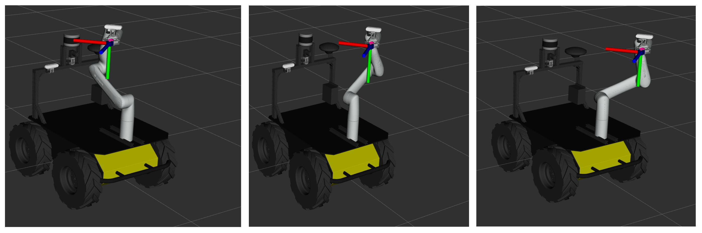

# kinova_planning package


Welcome to the README for the kinova_planning package. This package manages a kinova gen3 lite manipulator. 
There is a monocular camera attached to the EEF of the arm, to do monitoring tasks. The package is build with the 
following hardware setup in mind: a Husky moving holonomic mobile robot with a Kinova Gen3 Lite manipulator attached
to its base. The vehicle also includes a second monocular camera mounted on the Husky base, together with a LiDAR. 

This package consists of a single python file that starts one node. After initialization, this moves the Kinova arm
from whichever configuration to the "resting" pose. From that point onward, the node will be awaiting service calls 
from other nodes to start any actual functionality. 
## Code execution

To run the node by itself:

``` bash
cd <my_catkin_ws> # run from your catkin workspace directory
source devel/setup.bash
rosrun cor_mdp_husky_kinova_planning kinova_planning_node
```

## Functionality
The node provides 3 top level functions:
- Move arm to a resting pose.
- Move arm to a standing pose and point the camera to a desired 3D point. 
- Move arm to continuously track a desired 3D point in space with the camera.

Such a 3D point is in the source code described as a "point of interest". Below, the three functionalities are described
in more detail.
### Resting pose
The node starts with moving the arm to the resting pose if it is not already. This pose makes sure that the arm is not
blocking the LiDAR sensor. Next to that, it also puts the arm within the footprint of Husky, so there is no risk of 
collision whenever Husky is driving around.


### Look at point
The arm can also be moved to have the camera look at a specific point in 3D space. This functionality is used for 
example when a human is detected from the LiDAR point cloud data, and we want visual confirmation by detection from 
the camera. The arm will then move to an upright position, and point the camera to any point in whichever direction
around it. 


### Track point
Finally, the Kinova arm can be used to track a certain point (point of interest) in 3D space. This function takes a
point in 3D space in a static reference frame, and then does the following:
- Find the transform to the local arm frame, and transform the point from global frame to local frame at a specific time
- From the vector between the arm base and the POI, find 2 arm end effector (EEF) positions: one perpendicular to the 
left of it, and one perpendicular to the right
- Calculate the correct camera orientation at these 2 EEF positions to have the camera point at the POI
- Plan a cartesian path between the left pose and the right pose, and move the arm continuously between the two

The arm will now continuously move between a left pose and a right pose while keeping the point of interest in the
center of the field of view of the camera, providing optimal inspection from varying perspectives. 




## Services
The above-mentioned functionalities can be accessed from service calls. 

``` bash
/go_resting     #standard "Trigger" service message from std_srvs.srv
/look_at_point  #custom "camera_goal" service message from check_for_humans.srv
/track_point    #custom "camera_goal" service message from check_for_humans.srv
```