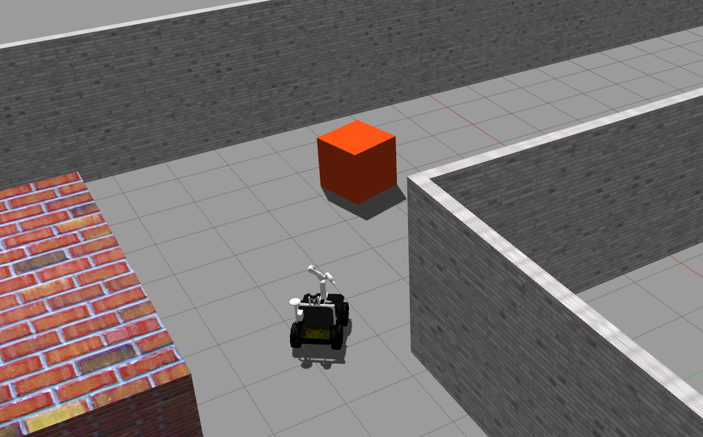

# Cor Multidisciplinary Project - Husky Simulation


Welcome to the Multidisciplinary Project - Husky Simulation repository! This repository aims to be a simple one stop shop for simulating Husky. All dependencies with their exact remote and version are listed in the `.rosinstall`. Using this it is possible to install locally.

**Important:** The only officially supported Ubuntu/ROS version is Bionic/Melodic for the Husky simulation.

## Installation

Create a catkin workspace and clone all required dependencies listed in `cor_mdp_husky.rosinstall`. To automate the process [vcstool](http://wiki.ros.org/vcstool) can be used:

``` bash
mkdir -p <my_catkin_ws>/src # if no catkin_ws yet
cd <my_catkin_ws>/src
git clone https://gitlab.tudelft.nl/cor/ro47007/2022/team-<XX>/cor_mdp_husky.git
vcs import --input cor_mdp_husky/cor_mdp_husky.rosinstall .
cd ..
```

> Note: replace the `<XX>` with your team number

### Build instructions
> Note: ros_kortex require additional step to build, follow the steps on [ros_kortex](https://github.com/Kinovarobotics/ros_kortex.git)

Install any system dependencies before build
``` bash
sudo rosdep init
rosdep update
rosdep install --from-paths src --ignore-src --rosdistro=$ROS_DISTRO -y
```

Finally build and source the workspace:
``` bash
catkin build && source devel/setup.bash
```

## Quickstart

### SamXL project

```
roslaunch cor_mdp_husky_gazebo husky_samxl.launch
```


### Lely project

```
roslaunch cor_mdp_husky_gazebo husky_lely.launch
```



