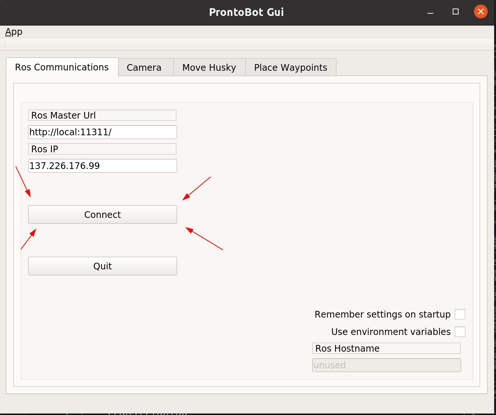
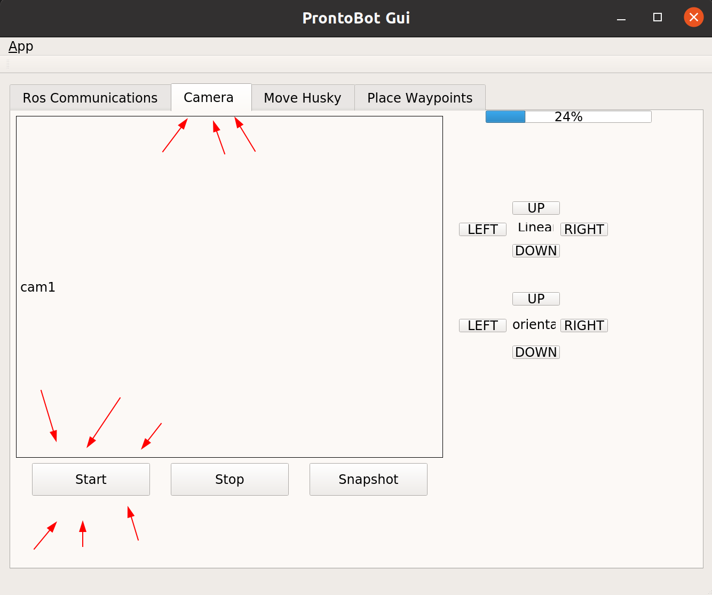
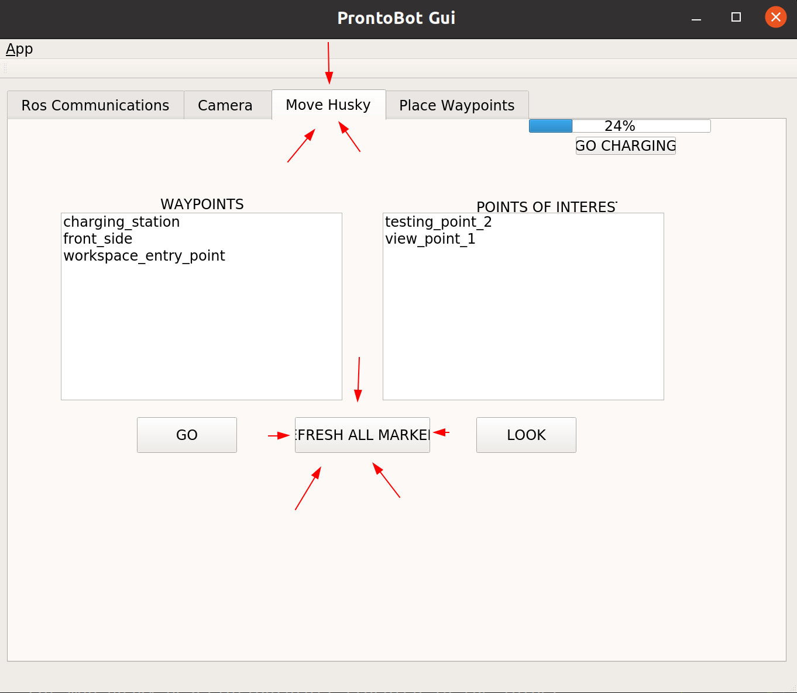
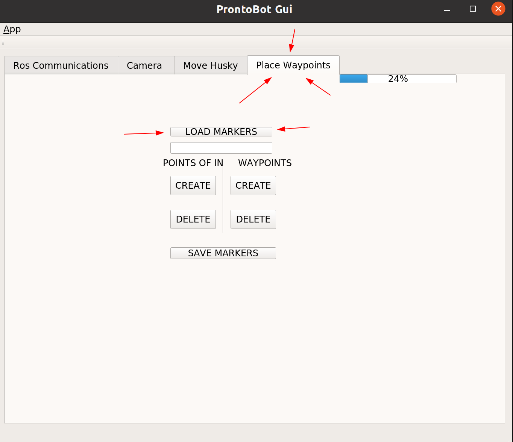

# qtros

<p align="justify">
Welcome to qtros package. This workspace is built with c++. You can see the table of content below where the gui panel is presented with its characteristics. The installation section gives you command you need to type in your command line in order to run this package. In the code section, the several files are explained in details.
</p>


<details open="open">
<summary>Table of Contents</summary>

- [Overview](#Overview)
       - [tab1](#tab1) 
       - [tab2](#tab2)
       - [tab3](#tab3)
       - [tab4](#tab4)        
- [Installation](#Installation)
- [Code](#Code)
       - [src](#src)
       - [include](#include)
       - [ui](#ui)
	
</details>

## <a name="Overview"></a>Overview
This package contains a node that builds the graphical user interphace window. The user can communicate with the robots via this graphical interface. Below are the description of each tab that will appear in the user's screen when this last one launches the package.
### <a name="tab1"></a>tab1
<p align="center">

</p>
<p align="justify">
 
The first tab shown above allows the user to connect to the master node or stop the connection. The user can enter the ROS Master Url and Ros IP address. The settings can be remembered the next time the gui is run. 
</p>

### <a name="tab2"></a>tab2
<p align="center">

</p>
<p align="justify">

In the second tab camera, the user can visualize the camera output by pressing the button start. The user can stop the process at any time by pressing the button stop. By pressing the button snapshot, the user can take a snapshot  wich will saved in a relative path which must be declared in [here](https://gitlab.tudelft.nl/cor/ro47007/2022/team-15/cor_mdp_husky/-/blob/testing/qtros/src/main_window.cpp#L313). On the right, the user can perform teleoperation of the end effector either by moving it translational wise or rational wise.
</p>

### <a name="tab3"></a>tab3
<p align="center">

</p>
<p align="justify"/>
Inside the move husky tab, the user can press the button `refresh all markers` to load all the markers saved in previous sessions. The user can then click on the waypoint of his choice in the list on the left and press the button `GO` to let Husky go to the desired location.  
Similarly, the user can click on a point to look at in the right list, and then press `look` to let kinova arm place its end effector such that the desired point of interest is in the camera's field of view. 
If the battery falls under a threshold, the user will be informed and can press the button `go charging` to stop all activities and let Husky go back to its charging station.
</p>

### <a name="tab4"></a>tab4
<p align="center">

</p>

<p align="justify">
In the Place Waypoints tab shown above, the user can spawn the markers saved in previous sessions in rviz by pressing `load markers`. The user can interact with the markers on Rviz, see [point_mgmt/Readme](../point_mgmt). In addition, the user can create a new marker being a waypoint or a point of interest. 
He must choose a name by typing in the edit line and then decides either the marker is a 2D waypoint for Husky to reach or a 3D point of interest that Kinova could track. The user will need to switch to Rviz window to place the spawned marker in a location he sees fit. After that, the user can go back to the GUI window and press the `save markers` button.
The freshly saved marker will be now be remembered in future sessions. If the user wants to move husky to the new waypoint or make kinova look at the new waypoint, the user must go to the `move husky tab` and follow the directives stated above.
</p>

## <a name="Installation"></a>Installation
<p align="justify">
To run this package, you first need to install qt5 software.

``` bash
sudo apt-get update
sudo apt-get install qt5-default
sudo apt-get install qtcreator
sudo apt-get install ros-melodic-qt-create
sudo apt-get install ros-melodic-qt-build
```
You then can run the node with the following:

``` bash
rosrun qtros qtros
```
The window with the tabs explained above will appear alongside a prontobot popup informing you that the node is running.
</p>

## <a name="Code"></a>Code

[//]: # (Symbols we can use for folder structure  │  ├  ─  └)
The package is organized in the following manner:
```
qtros
 │
 ├─── CMakeLists.txt
 │
 ├─── package.xml
 │
 ├─── README.md
 │
 │
 ├─── include
 │     └─── qtros
 │            │─── main_window.hpp
 │            │─── qnode.hpp
 │            └─── ui_main_window.h
 │
 ├─── src
 │     ├─── main.cpp 
 │     │─── main_window.hpp 
 │     └─── qnode.cpp
 │
 │
 ├─── launch
 │     └─── gui.launch
 │
 ├─── ui
 │     └─── main_window.ui
 └─── resources
       ├─── images.qrc
       └─── images
              │─── icon.hpp
              │─── tab1.hpp
              │───...
              └─── tab4.png
            

```
### <a name="src"></a>src
Inside `src`, three cpp files are present to declare the various subsribed topics and the callback functions ([qnode.cpp](src/qnode.cpp)), and the signals & slots or qt widgets implementations ([main_window.cpp](src/main_window.cpp)).  
The most important file is `main_window.cpp` that defines all the slots (functions that define what is happening when a button is pushed). The description of each function can be found at the begining of each function's body. 
Inside `main.cpp`, the ros node is initialized.

### <a name="include"></a>include
Inside `include`, the hpp files of `main_window.cpp` and `qnode.cpp` can be found. The classes are defined in which the several functions, publishers and subscribers are declared.
In `ui_main_window.h`, the widgets are being defined for cmake and the cpp files to understand. This file is generated after `catkin build` the first time, and  can be found inside `build/qtros`. The file can then be moved to `include/qtros` and the catkin build command can be run again, this time without errors.

### <a name="ui"></a>ui
The `ui/` directory contains the ui file named [main_window.ui](ui/main_window.ui) that stores the different configurations for the graphical interface programm. This ui file is automatically generated after designing the different tabs of the gui in Qt5 designer software and saving it as an .ui file. Several widgets such as push buttons, labels, line edits, list widget,  are dragged and dropped onto the main window. The widgets are then given an appropriate name for easier differenciation between the several buttons when assigning them with a specific task during coding.


