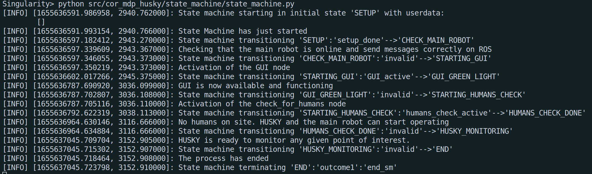

# State Machine - A closer look

## Structure overview 
This state machine (SM) has been developed to regulate the processes of the robot. According to the **state** in which the SM is, some nodes are activated and others deactivated. Consequently, the robot performs only the actions defined in the active nodes.

It has been developed using a ROS library called [smach](https://wiki.ros.org/smach). The code is subdivided into two files: `state_machine.py` and `sm_functions.py`. In the first one, we define the states and their property (a state can be of different types, check [Section 2.1](http://wiki.ros.org/smach/Documentation)); in the second file, we define the function associated with each state, i.e. the action that each state has to accomplish.

There are two  main ideas to interact with nodes:
- The state sends a message on a specific topic to activate a dormant node.
- The state terminates when a node published a specific message on the topic monitored by the state.

## Structure Details

The state machine goes through the following states:

- **SETUP**: it is a dummy state to give time to the code to correctly start

- **CHECK_MAIN_ROBOT**: it is a monitoring state that verifies if the main robot of the simulation or real environment is currently publishing its position on ROS.

- **STARTING_GUI**: with this state the user is aware of the fact the GUI is running. The node of the GUI itself is run through its own launch file.

- **GUI_GREEN_LIGHT**: another monitoring state. When the operator is ready to start the exploration of the environment to detect humans a message on the topic `/sm_messages` is published and the SM machine jumps to the next state.

- **STARTING_HUMANS_CHECK**: this state activates the check for humans subroutine publishing a message on the topic `/sm_messages/start_humans_check`.

- **HUMANS_CHECK_DONE**: when the operator says that the exploration is finished, a message on the topic `/sm_messages/humans_check_done` is detected by this monitoring state, and the state machine transit to the next state.

- **HUSKY_MONITORING**: now HUSKY is ready to start its nominal task. In this state, all the control of the activities can be handled in the GUI.

- **END**: when on the GUI the user presses `quit`, the state machine enters this last state that terminates the process.


## Installation Process

**N.B These steps are also listed in the main README of the repository. You do not need to execute them if you have already done them once.**

To use correctly the state machine, you need to install some extra packages in ROS:
``` bash
sudo apt-get update
```
``` bash
sudo apt-get install ros-melodic-smach ros-melodic-smach-ros ros-melodic-executive-smach ros-melodic-smach-viewer
```
The state machine can be easily run as a simple python file, after that the main simulation has been launched. To do so, open a terminal window in the folder that contains `state_machine.py`, and run the followings:
``` bash
source devel/setup.bash
```
``` bash
cd <directory_of_your_code>
python state_machine.py
```
If you want to see a graphical interface of the state machine, open a new terminal window and write the following commands:
``` bash
source devel/setup.bash
```
``` bash
rosrun smach_viewer smach_viewer.py
```
**Attention:** This visualization tool is a bit unstable, and sometimes you need to run it multiple times to obtain the correct result. It might also have some conflicts with other packages and do not work at all. 

You can always follow the state machine from the terminal you use to run it. From it, the full process to the SM should look like the picture below.


