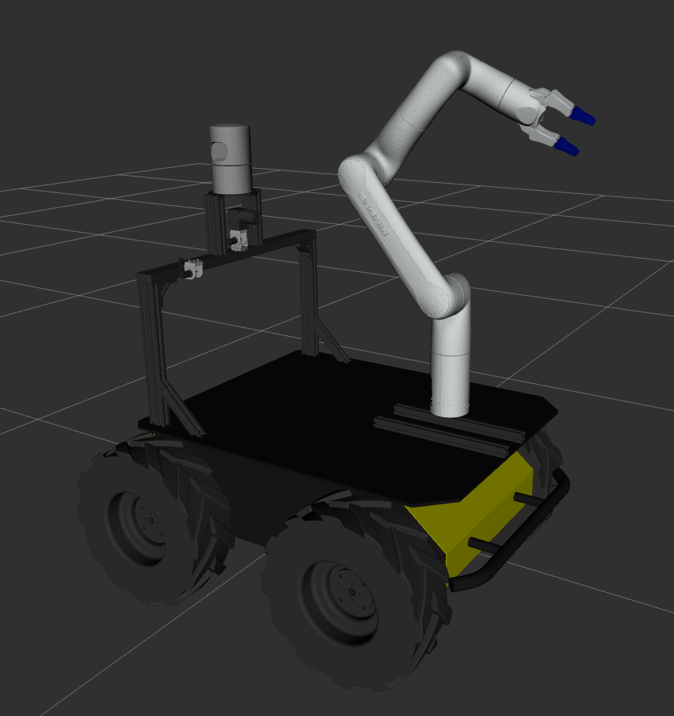
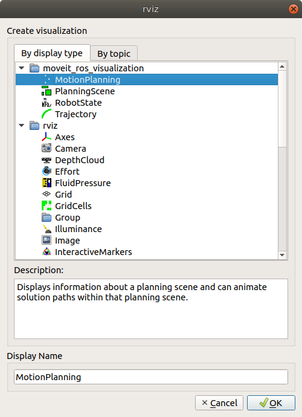
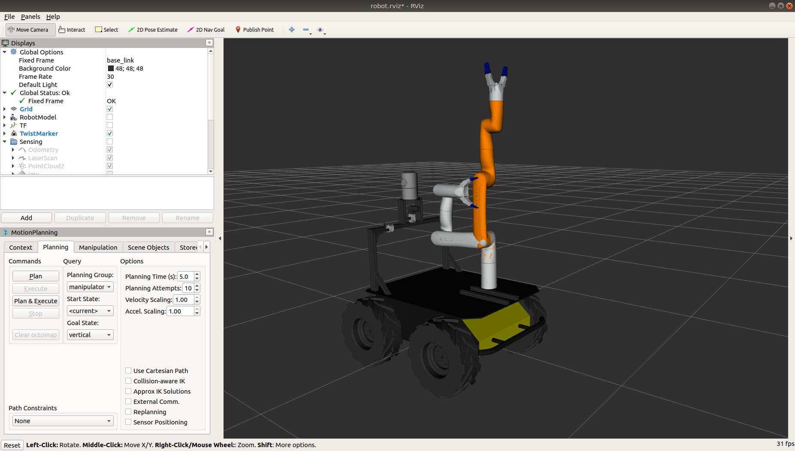
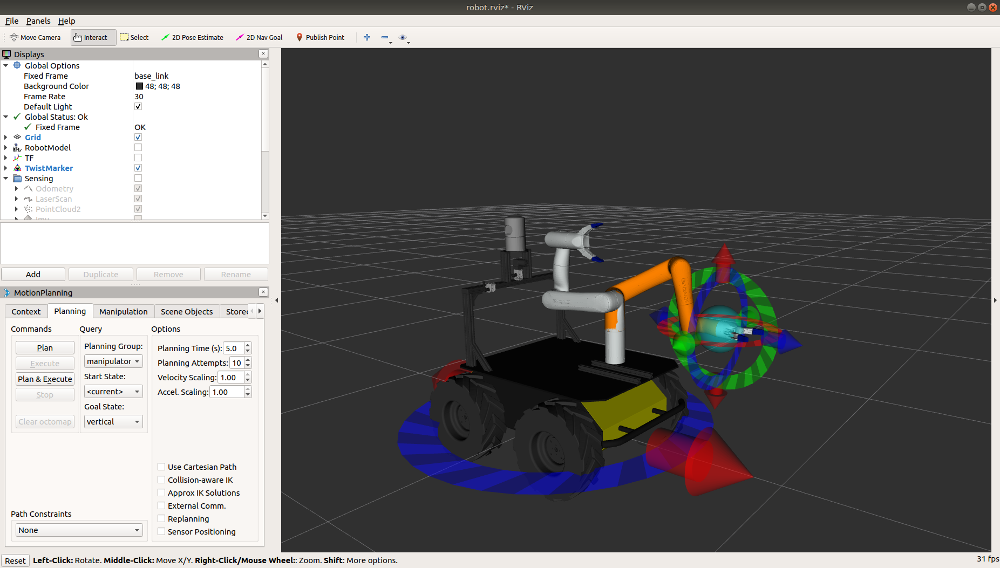

duot06
========

Repo for the DUOT06 Husky.  Robot includes Kinova Gen3 Lite manipulator arm, Swiftnav Duro with RTK, Velodyne HDL 32e
lidar, Autek wireless e-stop, Xsens IMU and Jetson AGX Xavier.




Arm Usage
-----------

The ROS driver for the arm will not start automatically, unlike the drivers for the rest of the payloads.

To start the arm, first manually position the arm so it is mostly vertical.  The arm's joints will lock into their
current position when powered-on, and the arm must not be in a self-collision state (as defined by the ROS collision
models) when the joints engage.  The easiest way to avoid this is to move the arm to a mostly-vertical position
before powering-on the arm.

Once the arm has been powered-on and the servos have locked into position, log into the robot and run the following
command to start the Kinova driver:

```bash
roslaunch husky_kinova_bringup husky_gen3_lite_bringup.launch
```

This will launch the arm driver and begin publishing the joint data on the `/joint_states` topic.

To use Moveit to control the arm, log into the robot with a separate terminal and run

```bash
roslaunch duot06_gen3_lite_moveit_config duot06_gen3_lite_moveit_planning_execution.launch
```

On your laptop, set your `ROS_MASTER_URI` to point to the robot, launch rviz, and open the Moveit Motion Planning
plugin.


Controlling the arm with Rviz
------------------------------

To control the arm with Rviz, first ensure that your network is configured to allow remote ROS connections.  Edit the
`/etc/hosts` file on the robot to add your PC's hostname and IP address, and add the robot's hostname and IP address
to the same file on your PC.  Then set your PC to use the robot as its ROS master:

```bash
export ROS_MASTER_URI=http://cpr-duot06:11311
```

Then launch the `husky_viz` package's `view_robot.launch` file on your PC:

```bash
roslaunch husky_viz view_robot.launch
```

Click the "Add" button to add the Moveit motion planner to Rviz:



Using this plugin you can move the arm from its current position to one of the two pre-defined poses: `vertical` (with
all of the joints set to the zero position, resulting in the arm sticking straight up) or `stow` (with the arm folded
back to be out-of-the-way for driving).

In the drop-down menus select "Current" as the start pose, and the desired pre-selected pose as the "Goal".  Press the
"Plan and Execute" button to move the arm.



Alternatively, click on the "Interact" button on the main toolbar of Rviz to add a Wrench control to the display.
Using the rings and arrows you can move the arm's end-effector along all 3 axes, as well as rotating it along any
axis.  Using this you can move the arm from its current position anywhere you want.

Once the arm is positioned where you want, click the "Plan and Execute" button to move the arm to the desired location.




Gripper Usage
--------------

The gripper is not included in the default Moveit configuration.  To open/close the hand, publish to the
`/kinova_arm/gen3_lite_2f_gripper_controller/gripper_cmd/goal` topic.
